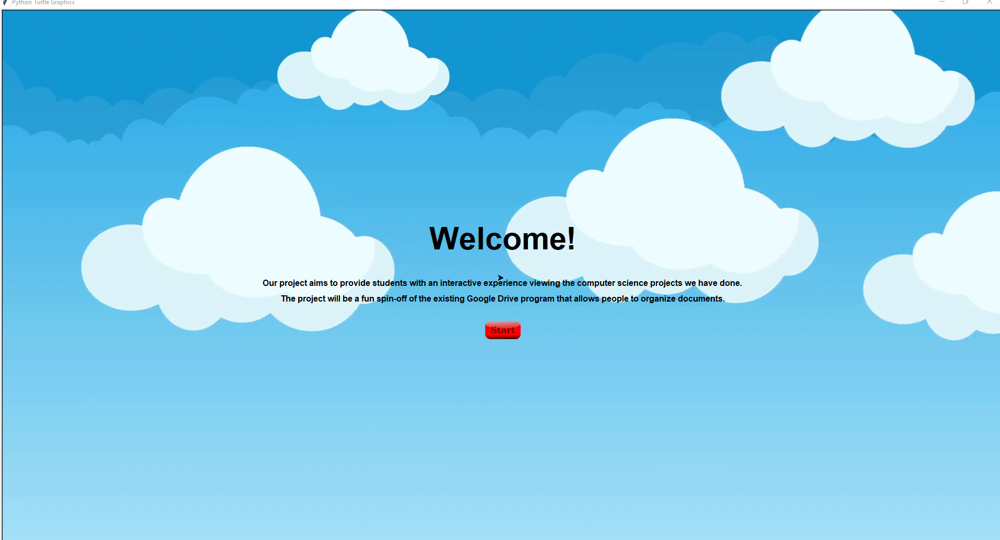
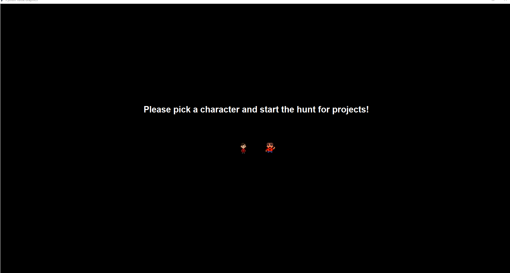
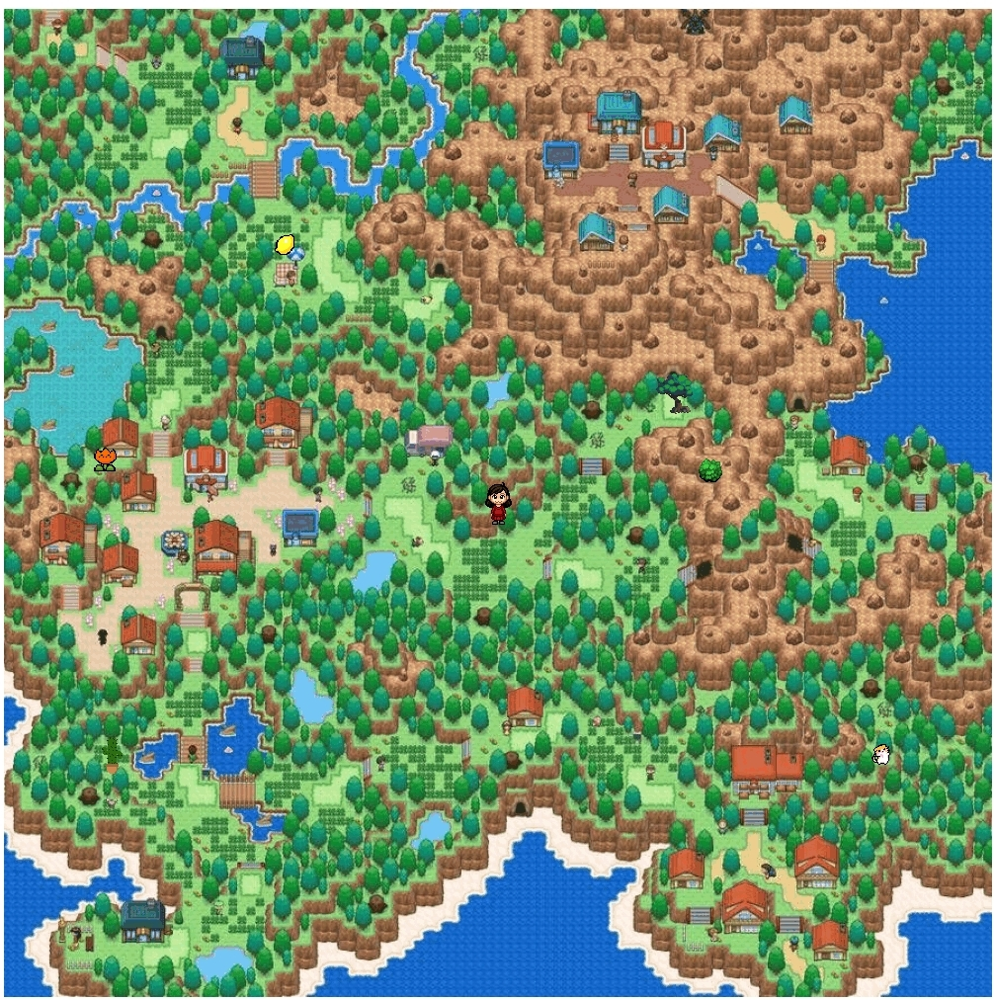
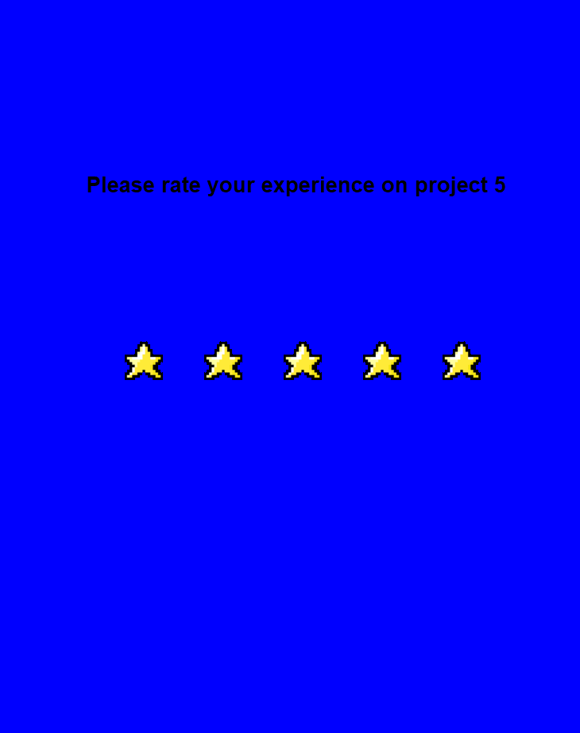
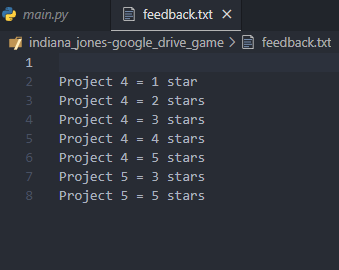

# indiana_jones-google_drive_game
For the open-ended final project using Python Turtles only, I created a game that stores students' reviews of the CS Projects we did in class and it will be a file for the teaching staff to review the data.

## Start Screen

## Select a character screen

## Map with objects for the player to navigate and find, once hovering over the icon. A button will pop up and start the slide show.

## Project Review Page: Allows them to select a start out of 5

## Updates to a txt file for staff to review

